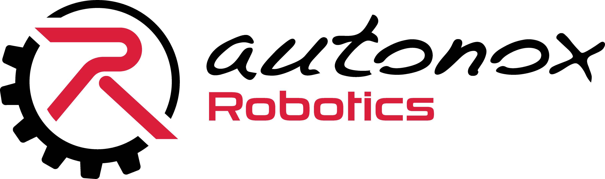
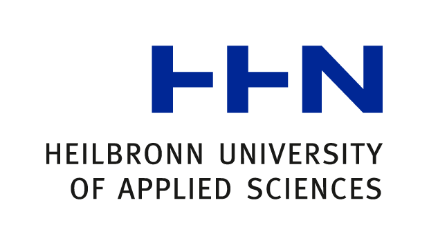

# joint_state_transformer

  
  

The **joint_state_transformer** computes a valid joint configuration from a minimal set of independent joints using the robot's constraint model. It enables the integration of parallel robots into the ROS ecosystem.

## Features
1. **Joint State Completion**  
   Computes dependent joints from independent ones.  
   Default input/output topic: `/joint_states`

2. **Trajectory Transformation**  
   Transforms incoming trajectories (e.g., from MoveIt2) into the robot's active joint space.

## Installation
1. Add `robot_model`, its dependencies, and this repository to your workspace  
2. Build the workspace  
3. Source the setup file  

## Usage
Run the node via the provided launch file. The urdf-file must be made available via the `robot_description` topic (e.g. by `robot_state_publisher`).

### Parameters
- `max_iterations`  
  Maximum iterations for the Levenberg-Marquardt solver.  
  Internal local iterations: `ceil(sqrt(max_iterations))`
  default: 100

- `tolerance`  
  Stops the solver when constraint error falls below this value
  default: 1e-5

- `max_step_line_search`
  Maximum number of iterations for the line search in the Levenberg-Marquardt algorithm.
  default: 10

- `input_action_name`  
  Source trajectory action (e.g., MoveIt2)
  default: /follow_joint_trajectory

- `output_action_name`  
  Target action receiving the transformed trajectory
  default: /joint_trajectory_controller/follow_joint_trajectory

- `input_joint_states_topic`  
  Topic with measured joint states (can be the same as `output_joint_states_topic`)
  default: /joint_states

- `output_joint_states_topic`  
  Topic publishing computed joint states (used by `robot_state_publisher`)
  default: /joint_states

## Support
Fabian.Finkbeiner@hs-heilbronn.de

## Roadmap
- Integration of URDF extensions into `urdfdom`
- Integration of the joint state completion into a `robot_state_publisher` fork
- Dedicated kinematics solver for trajectory transformation and collision checking

## Acknowledgment
Developed by the Robotics Lab at Heilbronn University of Applied Sciences  

Supported by autonox Robotics GmbH
